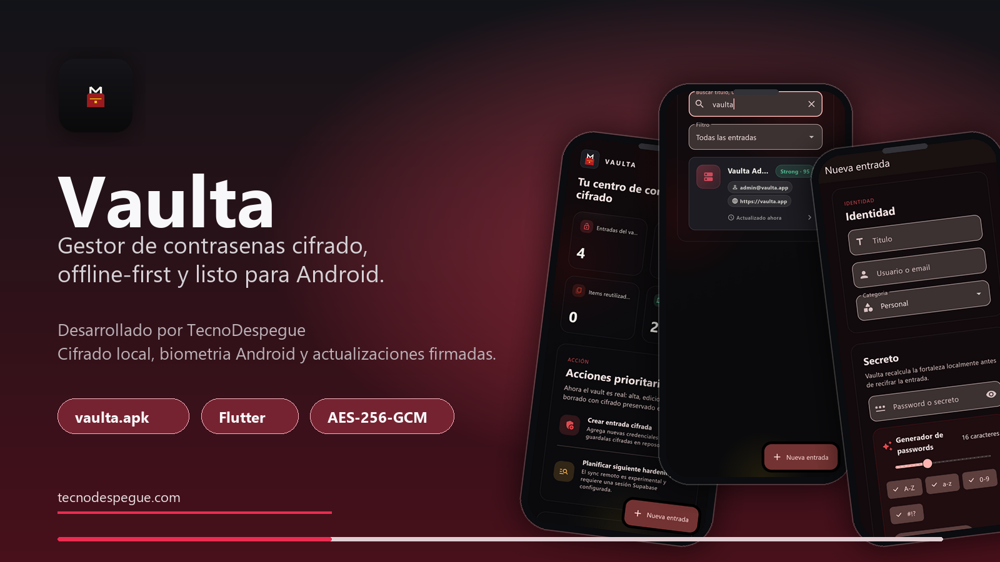

<p align="center">
  
</p>

<h1 align="center">Vaulta</h1>

<p align="center">
  <strong>Gestor de contrasenas cifrado, offline-first y multiplataforma (Android y Windows).</strong>
</p>

<p align="center">
  <a href="https://github.com/Rene-Kuhm/Gestor-de-Contrase-as/releases/download/dev-latest/vaulta.apk">Descargar APK (Android)</a>
  ·
  <a href="https://github.com/Rene-Kuhm/Gestor-de-Contrase-as/releases/download/dev-latest/vaulta-windows-bundle.zip">Descargar bundle Windows</a>
  ·
  <a href="https://github.com/Rene-Kuhm/Gestor-de-Contrase-as/releases/tag/dev-latest">Ver release</a>
  ·
  <a href="https://www.tecnodespegue.com/">TecnoDespegue</a>
</p>

Vaulta es una aplicacion desarrollada por [TecnoDespegue](https://www.tecnodespegue.com/) para proteger credenciales sensibles con una experiencia moderna, rapida y consistente entre Android y Windows. El proyecto combina Flutter, Material 3, cifrado local real, desbloqueo biometrico en Android, desbloqueo con Windows Hello en desktop y un canal de actualizaciones firmado desde GitHub Releases.

## Vision

Vaulta nace como una solucion de seguridad personal construida con el enfoque de TecnoDespegue: codigo real, arquitectura limpia, automatizacion confiable y decisiones tecnicas transparentes.

El objetivo es ofrecer un vault local para guardar, buscar y gestionar credenciales sin depender de una conexion permanente, manteniendo una base preparada para evolucionar hacia sincronizacion segura, auditorias de seguridad y distribucion publica.

## Funcionalidades principales

- Vault offline-first con persistencia local cifrada.
- Cifrado AES-256-GCM para payloads del vault.
- Derivacion de claves con Argon2id.
- DEK aleatoria por vault y envelope protegido.
- Desbloqueo con master password en todas las plataformas.
- Desbloqueo biometrico real en Android mediante Android KeyStore y `BiometricPrompt`.
- Soporte para `local_auth` en Windows (Windows Hello) como factor secundario opcional.
- CRUD de credenciales con busqueda interna.
- Importacion local desde CSV y JSON con vista previa antes de guardar.
- Dashboard con metricas de seguridad del vault.
- Estados de carga, error, vacio y resultados.
- Bloqueo automatico por inactividad o cambio de estado de la app.
- Soporte inicial para autofill en Android.
- Canal de actualizaciones Android desde GitHub Releases.
- Build de Windows con tema oscuro forzado para garantizar contraste correcto sobre el fondo del escritorio.
- Publicacion automatica de binarios firmados: `vaulta.apk` (Android) y `vaulta.exe` (Windows).

## Estado del producto

Vaulta esta en etapa MVP release-ready para Android y Windows desktop. La app ya cuenta con cifrado local, biometria Android, `local_auth` integrado en Windows, actualizaciones firmadas, iconos Android personalizados y auditoria funcional reciente del buscador interno y las pantallas principales.

Plataformas soportadas:

- **Android**: experiencia completa, incluye biometria, autofill y canal de actualizaciones automaticas.
- **Windows desktop**: build nativo x64 (`vaulta.exe`) que reutiliza el mismo vault cifrado, persistencia local segura (Windows Credential Manager) y todas las funciones de gestion de credenciales. El desbloqueo biometric se ofrece como opcion mediante `local_auth` (Windows Hello) cuando esta disponible; el camino de master password sigue siendo el factor principal.

El desbloqueo biometrico completo esta implementado para Android. En iOS, macOS, Linux y web se conserva el camino de master password hasta implementar bindings equivalentes por plataforma.

> Nota de seguridad: Vaulta cifra datos locales, pero todavia no cuenta con auditoria criptografica externa. No se debe presentar como producto de seguridad certificado hasta completar una revision independiente.

## Stack tecnico

- Flutter (Android + Windows desktop)
- Dart `^3.11.3`
- Material 3
- `flutter_secure_storage` (Android Keystore + Windows Credential Manager)
- `local_auth` (Android `BiometricPrompt` + Windows Hello)
- `cryptography`
- `supabase_flutter`
- Android KeyStore
- Visual Studio Build Tools 2022 (toolchain de Windows)
- GitHub Actions
- GitHub Releases

## Arquitectura

```text
lib/
  app/
    bootstrap/        Arranque y configuracion principal
    design_system/   Componentes visuales reutilizables
    theme/           Tokens, colores y tema Material
  core/
    security/        Master password, cifrado, biometria y storage seguro
    sync/            Contratos y servicios de sincronizacion opcional
    update/          Verificacion de actualizaciones
  features/
    home/            Shell principal y navegacion
    security/        Gate de bloqueo y desbloqueo
    vault/           Dashboard, busqueda, detalle y editor de credenciales
    settings/        Configuracion, biometria, sync y actualizaciones
    access/          Integracion de autofill Android
```

## Seguridad

Vaulta implementa una postura de seguridad local basada en:

- Master password como factor principal de recuperacion.
- Argon2id para derivacion de clave.
- AES-256-GCM para cifrado autenticado.
- Clave DEK independiente del password del usuario.
- Envelope protegido para desbloqueo biometrico en Android.
- Bloqueo automatico al salir de primer plano o por inactividad.
- Manejo explicito de estados de error y sesiones revocadas.

La sincronizacion remota con Supabase existe como base tecnica opcional/experimental y no esta habilitada como promesa publica por defecto.

## Instalacion Android

Descargar el APK firmado desde el release actual:

[vaulta.apk](https://github.com/Rene-Kuhm/Gestor-de-Contrase-as/releases/download/dev-latest/vaulta.apk)

Instalacion manual por ADB:

```bash
adb install -r vaulta.apk
```

Tambien se puede actualizar desde la app:

```text
Ajustes > Buscar actualizaciones
```

## Instalacion Windows

Descargar el bundle completo desde el release actual:

[vaulta-windows-bundle.zip](https://github.com/Rene-Kuhm/Gestor-de-Contrase-as/releases/download/dev-latest/vaulta-windows-bundle.zip)

Una vez descargado:

1. Extraer todo el contenido del ZIP en una carpeta, por ejemplo `C:\Program Files\Vaulta\`. El paquete incluye `vaulta.exe`, todas las DLLs de runtime de Flutter, los plugins de Windows y la carpeta `data/` con assets.
2. Ejecutar `vaulta.exe`. La primera vez que se abra, Windows SmartScreen puede pedir confirmacion ("Mas informacion" -> "Ejecutar de todas formas") porque el binario todavia no tiene firma EV de code signing empresarial; la app funciona normalmente despues de aprobarlo.

> Importante: el ejecutable no se distribuye suelto porque necesita todas las DLLs y la carpeta `data/` en el mismo directorio. Si movés solo `vaulta.exe` a otra carpeta, la aplicacion no va a arrancar.

El vault se persiste en el perfil de usuario con cifrado AES-256-GCM y la master key se guarda en Windows Credential Manager via `flutter_secure_storage_windows`.

## Desarrollo local

Requisitos:

- Flutter estable
- Dart compatible con el SDK del proyecto
- Android Studio o toolchain Android para builds Android
- Visual Studio 2022 Build Tools con la workload "Desktop development with C++" + componente "C++ ATL" para builds Windows

Comandos principales:

```bash
flutter pub get
flutter analyze
flutter test
flutter run
```

Build Android release:

```bash
flutter build apk --release
```

Build Windows release:

```bash
flutter build windows --release
```

El artefacto queda en `build/windows/x64/runner/Release/gestor_contrasenas.exe` y todas las DLLs de plugins en el mismo directorio.

La firma Android release requiere secretos fuera del repositorio. Ver [docs/android-release-signing.md](docs/android-release-signing.md).

## Validacion

Validaciones esperadas antes de publicar cambios:

```bash
flutter pub get
flutter analyze
flutter test
flutter build apk --release
flutter build windows --release
```

El pipeline de GitHub Actions compila, analiza, firma y publica automaticamente los binarios en `dev-latest` con los nombres profesionales `vaulta.apk` (Android) y `vaulta.exe` (Windows).

## Documentacion relacionada

- [Firma y release Android](docs/android-release-signing.md)
- [Checklist de publicacion en stores](docs/store-release-checklist.md)
- [Plantilla de politica de privacidad](docs/privacy-policy-template.md)

## TecnoDespegue

TecnoDespegue desarrolla software fullstack, apps moviles multiplataforma y automatizaciones con IA para negocios que necesitan sistemas reales, escalables y mantenibles.

- Web: [tecnodespegue.com](https://www.tecnodespegue.com/)
- Especialidades: Flutter, Dart, Next.js, TypeScript, Python, automatizaciones con IA, APIs, integraciones y optimizacion de procesos.
- Enfoque: foco tecnico, codigo limpio, comunicacion transparente y entregas medibles.

## Licencia

Proyecto privado/publico de portafolio tecnico de TecnoDespegue. Definir una licencia formal antes de aceptar contribuciones externas o distribuir el codigo como open source.
